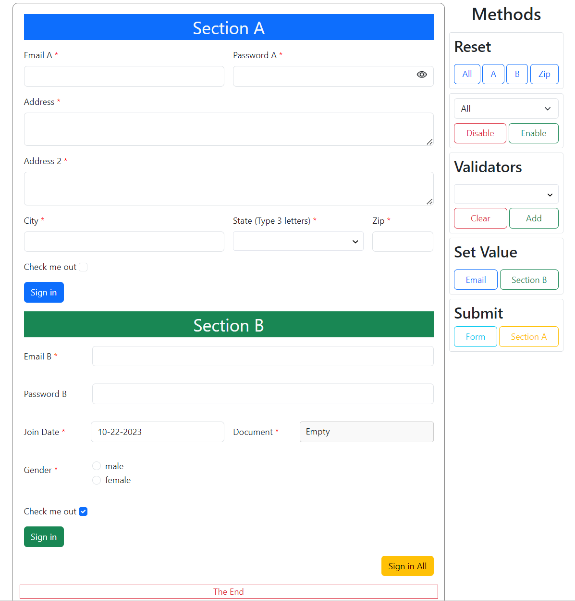

# ng-dyno-form

[](https://www.npmjs.com/package/ng-dyno-form)
[](https://github.com/kowsyap/dynoForm/actions/workflows/ci.yml)
[](LICENSE)

Build dynamic reactive forms in Angular from a simple config array.

```bash
npm install ng-dyno-form
```

**📖 Documentation:** see the [library README](projects/ng-dyno-form/README.md) for installation, usage, events and methods, and the [`DynoFormConfig` reference](projects/ng-dyno-form/dyno-form-config.md) for every field option. Release notes are in the [CHANGELOG](projects/ng-dyno-form/CHANGELOG.md).



## Repository layout

| Path | What it is |
| --- | --- |
| `projects/ng-dyno-form/` | The library published to npm as `ng-dyno-form` |
| `src/` | Demo app that uses the library (two pages of example forms) |
| `.github/workflows/` | CI (build and test on every push/PR) and npm release |

The demo app imports `ng-dyno-form` from the local build in `dist/ng-dyno-form` (see `paths` in `tsconfig.json`), so library changes show up in the demo without publishing.

## Development

Requires Node.js 22.

```bash
npm ci
npm start            # builds the library, then serves the demo at http://localhost:4200
npm run watch:lib    # rebuild the library on change (run alongside `ng serve`)
npm run test:lib     # library unit tests
npm run test:ci      # build + all tests in headless Chrome, as CI runs them
npm run build        # production build of the library and the demo
```

## Releasing

Releases are published to npm by the [release workflow](.github/workflows/release.yml) when a GitHub release is published.

1. Bump `version` in `projects/ng-dyno-form/package.json` and add an entry to the CHANGELOG.
2. Merge to `main`.
3. Create a GitHub release with a tag matching the version, e.g. `v1.2.0`.

The workflow builds and tests the library, checks that the tag matches the package version, and publishes `dist/ng-dyno-form` to npm.

## License

[MIT](LICENSE)
